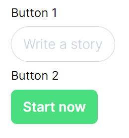
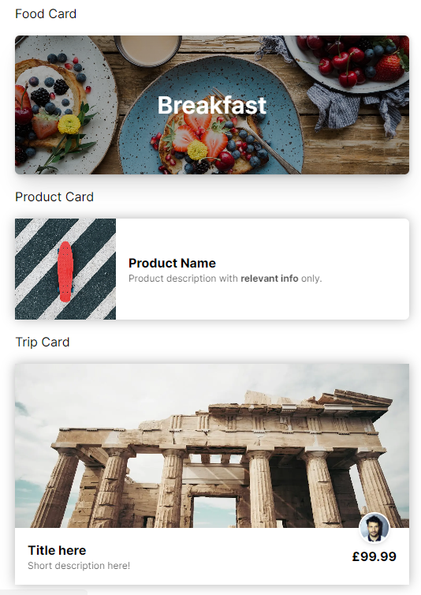
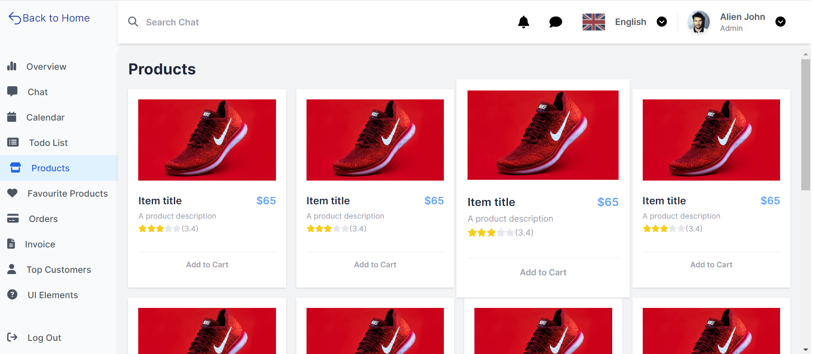

# Next.js Tailwind Practice

## Objective of Project
* Familiarise with Tailwind CSS before starting on NextJS projects
* Build some simple UIs (e.g. cards, landing pages etc). See below:

### Button Sprint

### Card Sprint

### Landing Page Sprint
* Followed the UI from: https://lewagon.github.io/landing-page-challenge/

### Open Component Challenge

## Acknowledgement
* This project was bootstrapped with the [Create Next App](https://nextjs.org/docs/app/api-reference/create-next-app)
* Button sprint, card sprint, landing page sprint, open component challenge were past exercises from Le Wagon's Web Development bootcamp.
